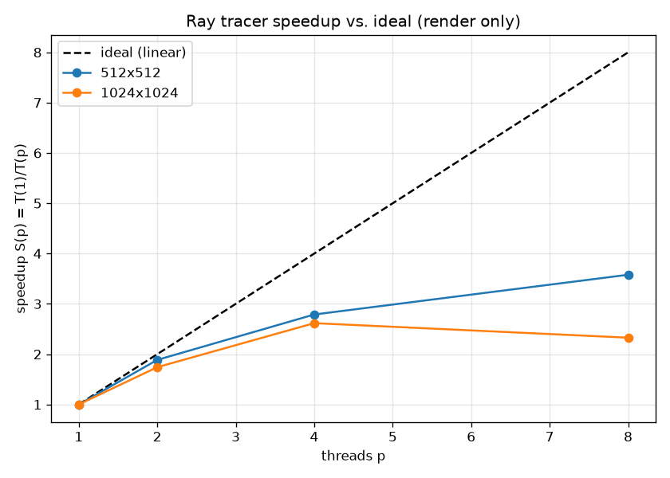

# Aufgabe 7.2

## Setup

- Cores: 8
- Compiler/flags: `g++ -O2 -fopenmp`
- Scene: `test.stl`
- Resolutions: 512x512, 1024x1024
- Thread counts p: 1, 2, 4, 8

## a) Runtimes T(p) and b) speedup S(p) / efficiency E(p)

### Render only (excluding file I/O)

**512x512**

| p | T(p) [s] | S(p) | E(p) |
|---|---|---|---|
| 1 | 0.6939 | 1.00 | 1.00 |
| 2 | 0.3679 | 1.89 | 0.94 |
| 4 | 0.2488 | 2.79 | 0.70 |
| 8 | 0.1939 | 3.58 | 0.45 |

**1024x1024**

| p | T(p) [s] | S(p) | E(p) |
|---|---|---|---|
| 1 | 2.6378 | 1.00 | 1.00 |
| 2 | 1.5151 | 1.74 | 0.87 |
| 4 | 1.0081 | 2.62 | 0.65 |
| 8 | 1.1332 | 2.33 | 0.29 |

### Total (including STL load + PPM write)

**512x512**

| p | T(p) [s] | S(p) | E(p) |
|---|---|---|---|
| 1 | 0.7223 | 1.00 | 1.00 |
| 2 | 0.4014 | 1.80 | 0.90 |
| 4 | 0.2830 | 2.55 | 0.64 |
| 8 | 0.2325 | 3.11 | 0.39 |

**1024x1024**

| p | T(p) [s] | S(p) | E(p) |
|---|---|---|---|
| 1 | 2.7640 | 1.00 | 1.00 |
| 2 | 1.6392 | 1.69 | 0.84 |
| 4 | 1.1498 | 2.40 | 0.60 |
| 8 | 1.3457 | 2.05 | 0.26 |

## c) Speedup vs. ideal linear speedup

## d) Amdahl's law fit

Fitting `S(p) = 1 / (f + (1-f)/p)` to the render-only speedups gives the serial fraction f (and an asymptotic speedup ceiling `1/f` as p -> infinity):

| resolution | serial fraction f | speedup ceiling 1/f |
|---|---|---|
| 512x512 | 0.1693 | 5.9 |
| 1024x1024 | 0.2907 | 3.4 |

